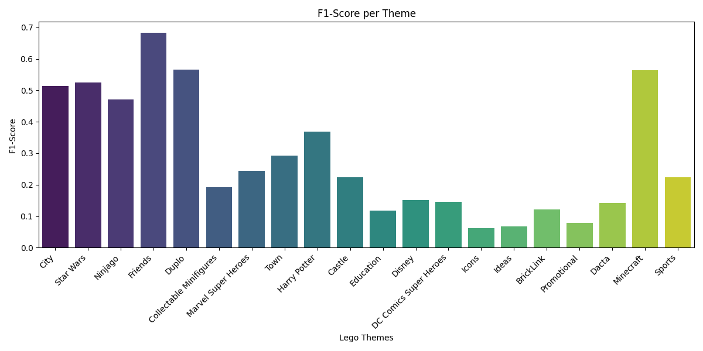
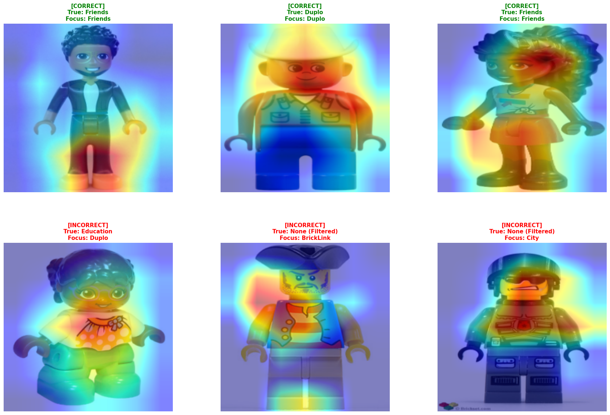

# Lego Minifigure Computer Vision Pipeline

## 1. Project Overview
This project constructs an end-to-end deep learning computer vision pipeline to classify images of Lego Minifigures. Given a dataset of minifigure images and corresponding JSON metadata (obtained via brickset.com), the goal is to develop a robust neural network capable of predicting the attributes of figures it has never seen before.

## 2. Task Objective: "Choice B" (Multilabel Theme Prediction)
Instead of a standard mutually exclusive multiclass approach (e.g., predicting exactly one category), this project tackles the significantly more complex **Choice B: Multilabel Classification**. 

Because a single Lego minifigure can belong to multiple themes simultaneously (e.g., both `"Basic"` and `"LEGOLAND"`), the model must treat every possible theme as an independent Bernoulli trial (a binary coin-flip). 
*   **Target Formulation:** The target labels are converted from lists of strings into binary vectors using Scikit-Learn's `MultiLabelBinarizer` (e.g., `[1, 0, 0, 1...]`).
*   **Scope:** To ensure statistical viability, the pipeline focuses on predicting the **Top 20 most frequent themes** in the dataset, filtering out extreme long-tail outliers.

## 3. Architecture
The project utilizes **Convolutional Neural Networks (CNNs)** via PyTorch, leveraging the power of **Transfer Learning**.

*   **Base Model:** A pre-trained `ResNet18` model (trained on the ImageNet dataset). ResNet18 acts as a robust "feature extractor," as its early layers already understand how to detect edges, curves, and basic shapes. The convolutional base layers are initially frozen to preserve these pre-learned weights.
*   **Custom Head:** The final Fully Connected (`fc`) layer of the ResNet18 architecture was replaced with a newly initialized, untrained `nn.Linear` layer outputting exactly 20 nodes (one for each theme).
*   **Loss Function:** Because this is a multilabel task, the network does *not* use Softmax. Instead, it uses `BCEWithLogitsLoss` (Binary Cross Entropy), which independently applies a Sigmoid activation function to every output node, allowing the model to predict high probabilities for multiple themes simultaneously.

## 4. Methodology: Addressing Class Imbalance
Real-world datasets follow a "long-tail" distribution; some themes (like *Star Wars* or *City*) have thousands of images, while others have very few. This pipeline implements a two-pronged mathematical approach to force the model to respect minority classes:

1.  **Gradient Starvation Prevention (`WeightedRandomSampler`):** Inverse-frequency sample weights were calculated for the training set. A custom sampler ensures that rare figures are oversampled and appear consistently in training batches, guaranteeing the model sees minority classes every epoch.
2.  **Gradient Magnitude Correction (`pos_weight`):** A custom `pos_weight` tensor was calculated and fed into the `BCEWithLogitsLoss` function. This heavily penalizes the optimizer if it incorrectly guesses "0" on a rare class, forcing it to aggressively update its weights when it ignores a minority theme.
3.  **Data Augmentation:** Real-time geometric augmentations (Random Horizontal Flips, Random Rotations up to 15 degrees) were applied only to the training set to artificially expand the dataset and prevent the model from memorizing exact pixel layouts.

## 5. Evaluation & Results

Due to the multilabel nature of the task, standard "Accuracy" and 2D Confusion Matrices are mathematically invalid. The model was evaluated on a reserved Test Set using the **F1-Score**, which balances Precision and Recall.



### F1-Score Analysis
The model achieved varying levels of success across the 20 themes:
*   **High Performers:** The model performs exceptionally well on distinct themes such as *Friends*, *Minecraft*, *Duplo*, and *Star Wars*. These themes have highly unique structural features (e.g., Minecraft's blocky heads or Friends' unique hairpieces) that the ResNet architecture identified quickly.
*   **Low Performers:** The model struggled with *Castle*, *Icons*, and *BrickLink*. This is largely due to sample scarcity and high visual overlap with generic themes (e.g., a generic knight could easily be confused with *Town* or *Promotional*).

## 6. Model Interpretability (Grad-CAM)
To ensure the CNN is learning actual Lego features and not "cheating" by finding artifacts in the image backgrounds (Data Leakage), we implemented **Gradient-weighted Class Activation Mapping (Grad-CAM)**. Grad-CAM visualizes the spatial gradients of the final convolutional layer to show exactly *where* the model is looking when it makes a prediction.



### Grad-CAM Insights:
*   **Correct Guesses:** The model is successfully learning discriminative, structural features. For the *Friends* figures, it consistently highlights unique hairpieces and torso shapes. For the *Duplo* figures, it recognizes the classic, oversized facial proportions.
*   **Incorrect Guesses:** The failures are highly logical. In cases where the model incorrectly guessed *Duplo* for an *Education* figure, the Grad-CAM confirmed the model was looking at the oversized head and facial styling—features which are visually identical to the Duplo theme. This proves the model's "logic" is visually sound, even when the ground-truth label differs.

## 7. How to Run the Pipeline

1. Ensure the dataset is downloaded and extracted to `data/images/` and the JSON is located at `data/minifigs.json`.
2. Install requirements: ran the terminal commands documented in the main README.me
3. Download the data by running the downloader.py script
```
python proj2/scripts/downloader.py
```
3. Execute the main pipeline

```
python proj2/main.py
```


